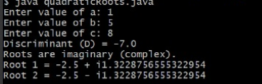

# EXPERIMENT-1
## 1a
## title :primitive DT
```java
class Datatypes
{
    static int i;
    static char c;
    static double d;
    static float f;
    static long l;
    static short s;
    static byte b;
    static boolean bool;
public static void main(String[]args)
{
System.out.println("default primitive datatypes:");
System.out.println("int:"+i);
System.out.println("char:"+c);
System.out.println("double:"+d);
System.out.println("float:"+f);
System.out.println("long:"+l);
System.out.println("short:"+s);
System.out.println("byte:"+b);
System.out.println("boolean:"+bool);
}
}

```
# output

# 1b
## title : Quadratic 
```java
 
import java.util.Scanner;

class QuadraticRoots {
    public static void main(String[] args) {

        double a, b, c, D;
        Scanner sc = new Scanner(System.in);

        System.out.print("Enter value of a: ");
        double a = sc.nextDouble();

        System.out.print("Enter value of b: ");
        double b = sc.nextDouble();

        System.out.print("Enter value of c: ");
        double c = sc.nextDouble();

        double Discriminant = b * b - 4 * a * c;
        System.out.println("Discriminant (D) = " + D);

        if (Discriminant > 0) {
            double root1 = (-b + Math.sqrt(Discriminant)) / (2 * a);
            double root2 = (-b - Math.sqrt(Discriminant)) / (2 * a);

            System.out.println("Roots are real and distinct.");
            System.out.println("Root 1 = " + root1);
            System.out.println("Root 2 = " + root2);

        } else if (Discriminant == 0) {
            double root = -b / (2 * a);
            System.out.println("Roots are real and equal.");
            System.out.println("Root = " + root);

        } else {
            double realpart = -b / (2 * a);
            double imaginarypart = Math.sqrt(-Discriminant) / (2 * a);

            System.out.println("Roots are imaginary (complex).");
            System.out.println("Root 1 = " + real + " + i" + imaginary);
            System.out.println("Root 2 = " + real + " - i" + imaginary);
        }

    }
}
 
```
# output


